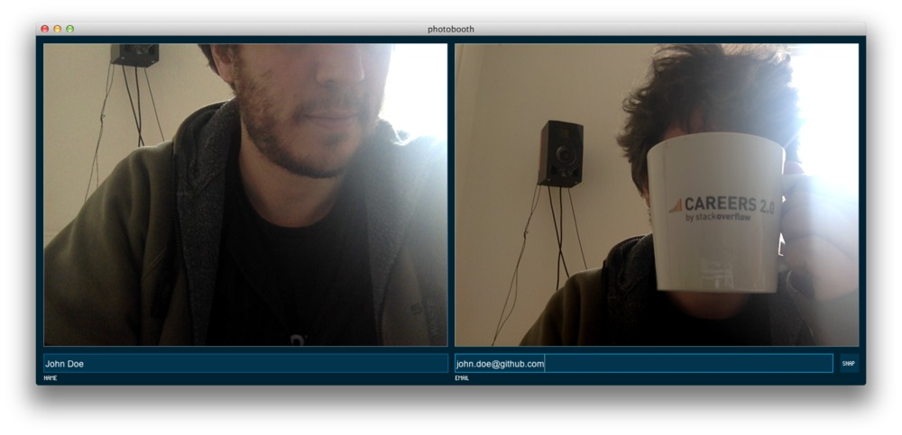
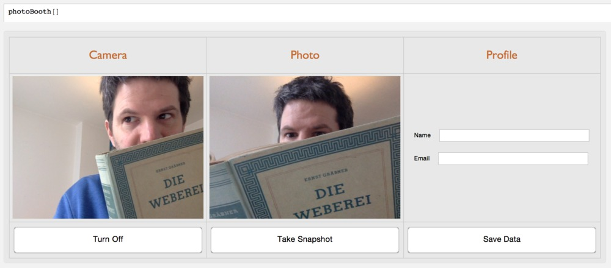

Photobooth
==========

## Processing Version

Quick and dirty Processing sketch to capture images of all the students in my course.  
It requires the *controlP5* library.

## Mathematica Version

Same thing for *Mathematica* 10.0.

### License 
This code is in the public domain.
